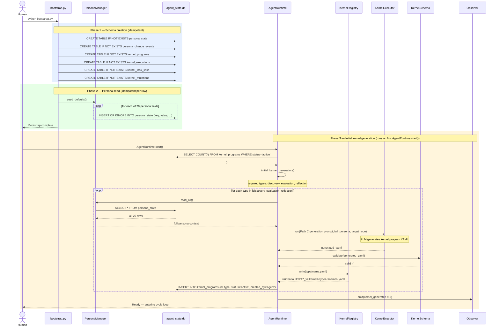
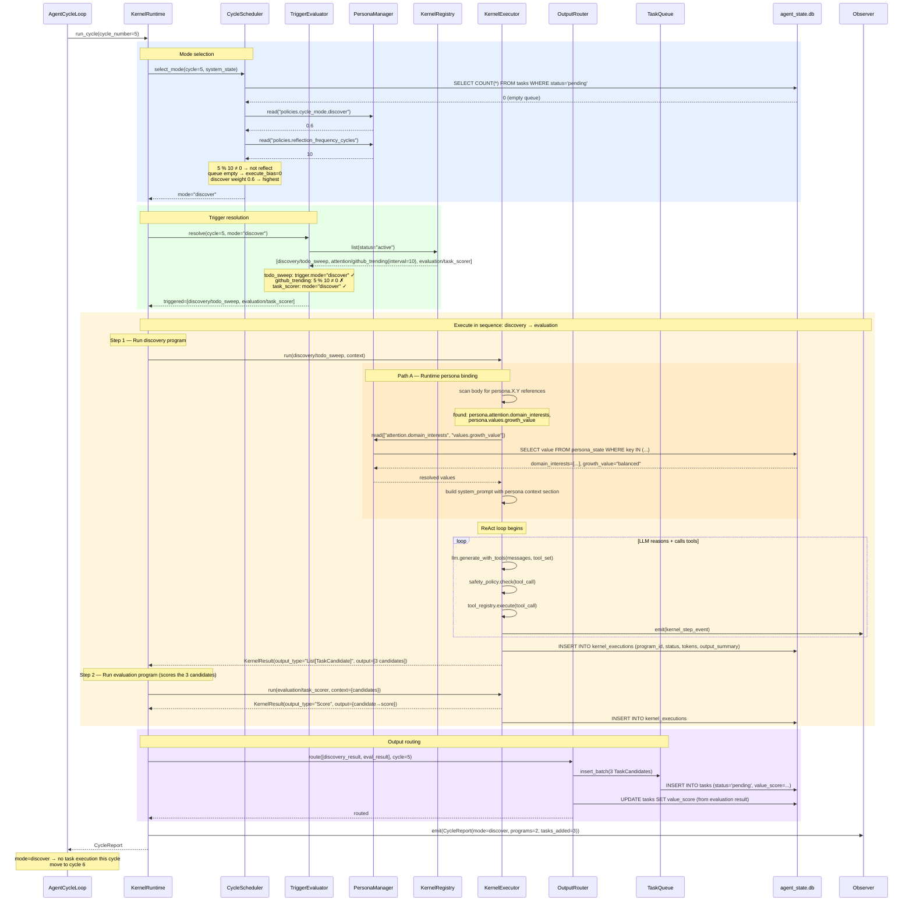
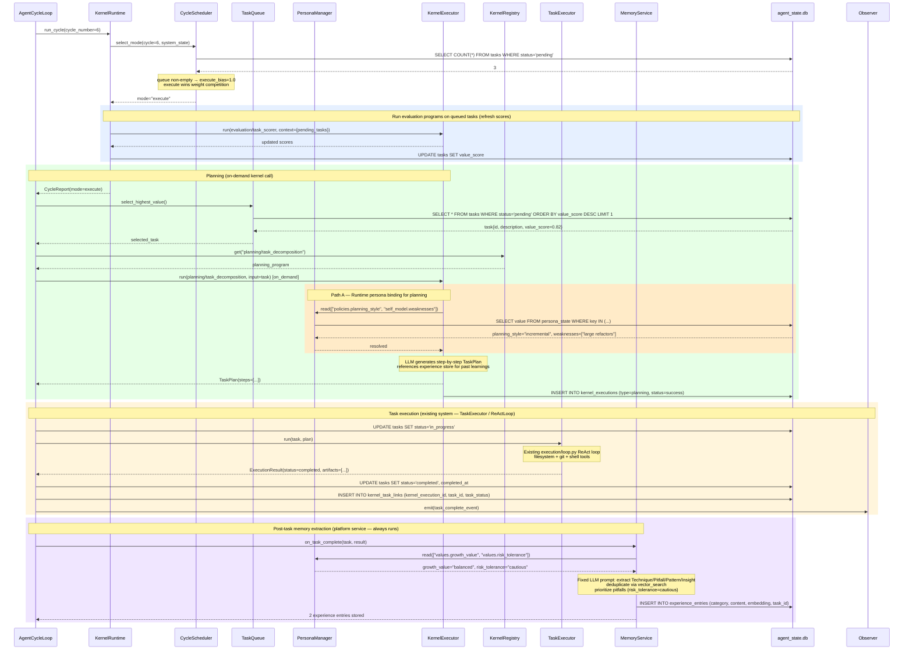
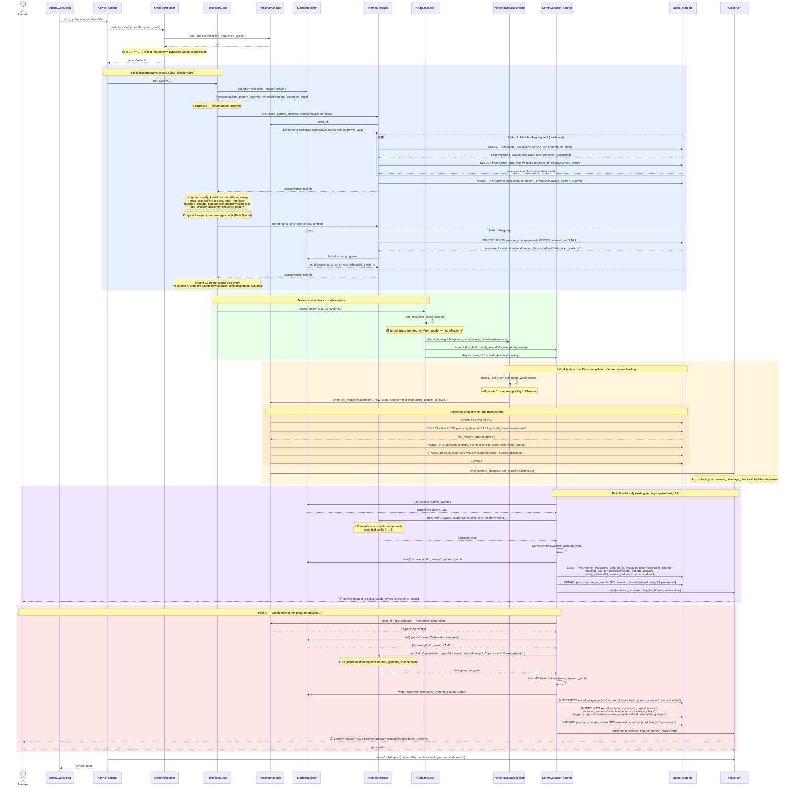
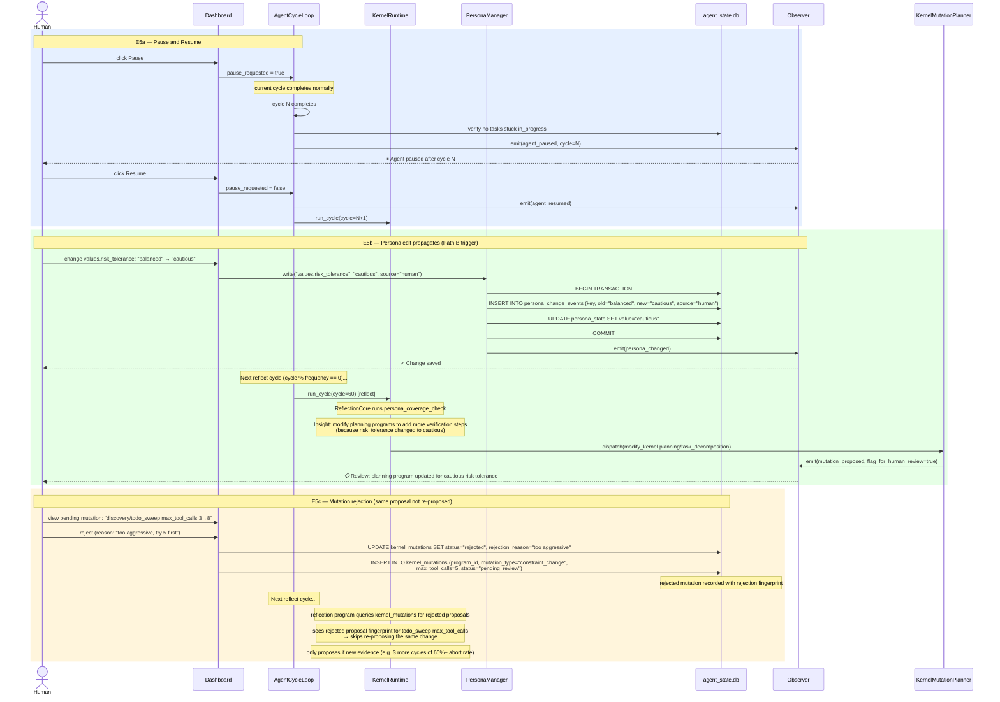

# Sequence Diagrams — Persona-Driven Kernel Architecture

Five diagrams covering the full system lifecycle. Read in order.

---

## Diagram 1 — Bootstrap & Initial Kernel Generation

One-time setup: DB initialization, persona seeding, and first kernel program generation.



---

## Diagram 2 — Discover Cycle

The agent finds new work. `mode=discover` runs when the task queue is low.



---

## Diagram 3 — Execute Cycle

The agent picks the highest-value task and executes it.



---

## Diagram 4 — Reflect Cycle (Path A + Path B + Path C)

The agent analyzes its own performance, updates persona, and mutates kernel programs.



---

## Diagram 5 — Human Controllability (E5 scenarios)

Pause, persona edit propagation, and mutation rejection.



---

## Component Dependency Summary

```
                          ┌─────────────┐
                          │   Human     │
                          └──────┬──────┘
                                 │ pause / persona edit / review
                          ┌──────▼──────┐
                          │  Dashboard  │
                          └──────┬──────┘
                                 │
                    ┌────────────▼────────────┐
                    │     AgentCycleLoop      │
                    └────────────┬────────────┘
                                 │ run_cycle()
                    ┌────────────▼────────────┐
                    │      KernelRuntime      │◄──────────────────┐
                    │  ┌──────────────────┐  │                   │
                    │  │ CycleScheduler   │  │                   │
                    │  │ TriggerEvaluator │  │                   │
                    │  └──────────────────┘  │                   │
                    └──┬──────────┬──────────┘                   │
                       │          │                               │
          ┌────────────▼──┐   ┌───▼──────────┐                   │
          │ KernelExecutor│   │ ReflectionCore│                  │
          │  (ReAct loop) │   │  (scheduler)  │                  │
          └────┬───────┬──┘   └───────┬───────┘                  │
               │       │              │                           │
    ┌──────────▼─┐  ┌──▼──────┐  ┌───▼──────────────────────┐   │
    │PersonaManager│ │KrnlReg. │  │       OutputRouter        │   │
    │ (Path A)    │ │(YAML I/O)│  │  ┌────────────────────┐  │   │
    └──────────┬──┘ └─────────┘  │  │PersonaUpdatePipeline│  │   │
               │                 │  └─────────┬──────────┘  │   │
               │                 │  ┌──────────▼──────────┐  │   │
               │                 │  │KernelMutationPlanner│──┼───┘
               │                 │  └─────────┬──────────┘  │
               │                 │  ┌──────────▼──────────┐  │
               │                 │  │    TaskQueue         │  │
               │                 │  └─────────────────────┘  │
               │                 └───────────────────────────┘
               │
    ┌──────────▼──────────┐
    │    agent_state.db   │
    │  persona_state      │
    │  persona_chg_events │
    │  kernel_programs    │
    │  kernel_executions  │
    │  kernel_mutations   │
    │  kernel_task_links  │
    └─────────────────────┘

    ┌─────────────────────┐
    │    TaskExecutor     │◄── called by AgentCycleLoop (execute mode)
    └──────────┬──────────┘
               │ on_task_complete
    ┌──────────▼──────────┐
    │    MemoryService    │
    │  (platform, fixed)  │
    └─────────────────────┘
```
